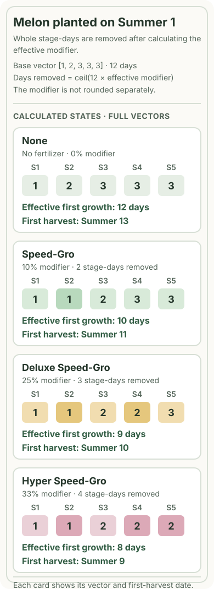
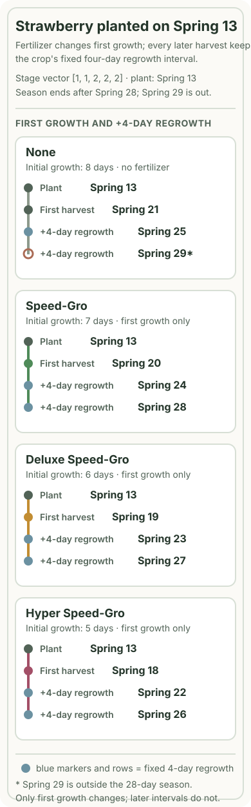

Speed-Gro is useful when the earlier first harvest changes your crop calendar. The fertilizer's 10%, 25%, or 33% label is not a promise that the crop will finish that many percent of calendar days sooner. The reliable decision is to compare the first harvest date for each tier you can actually use with the last useful day of the season. For a multi-harvest crop, keep the first-growth calculation separate from the crop's fixed regrowth interval: fertilizer can move the first harvest, but it does not make the later four-day or two-day interval shorter.

The method below assumes a normal outdoor soil tile, a watered planting day, and fertilizer that is effective on that planting day. The worked dates do not represent an in-game test; they are source-based calculations using crop stage data and the public crop-calendar assumptions. Use the method for a specific crop, planting day, season deadline, and available tier rather than treating any tier as universally best. The version boundary is the documented [1.6.15 PC/Steam patch](https://store.steampowered.com/news/app/413150/view/517448731263500640?l=english) and [1.6.15.1 console patch](https://www.stardewvalley.net/1-6-15-1-patch-for-xbox-playstation/); check your own game version before carrying a date across a later update.

## What Speed-Gro changes—and what it does not

### Compare the three tiers by effect and access

The three fertilizers use different growth modifiers. The modifier is an input to the crop's stage calculation, not a direct instruction to subtract the same percentage from the final number of days.

| Fertilizer | Listed growth modifier | With Agriculturist | Access facts that affect a plan |
| --- | ---: | ---: | --- |
| [Speed-Gro](https://stardewvalleywiki.com/Speed-Gro?oldid=190630) | 10% | 20% | Farming Level 3 recipe: 1 Pine Tar + 5 Moss makes 5; Pierre's sells it for 100g from Spring 15 of Year 1. |
| [Deluxe Speed-Gro](https://stardewvalleywiki.com/Deluxe_Speed-Gro?oldid=191196) | 25% | 35% | Farming Level 8 recipe: 1 Oak Resin + 5 Bone Fragments makes 5; Pierre's sells it for 150g from Year 2, and Oasis sells it for 80g on Thursdays. |
| [Hyper Speed-Gro](https://stardewvalleywiki.com/Hyper_Speed-Gro?oldid=190377) | 33% | 43% | Buy the recipe in Qi's Walnut Room for 30 Qi Gems; 1 Radioactive Ore + 3 Bone Fragments + 1 Solar Essence makes 1. |

The Agriculturist values are additive: the profession contributes another 10 percentage points. It does not multiply a fertilizer's percentage a second time. These numbers matter when you calculate the number of stage-days the game can remove, but they do not tell you the harvest date by themselves. A short crop can produce the same calendar result for two different tiers, while a longer crop may expose a full extra day between them.

The recipes deserve a version check because older instructions are easy to follow by accident. The official [1.6 full changelog](https://www.stardewvalley.net/stardew-valley-1-6-update-full-changelog/) says that Speed-Gro changed from 1 Clam to 5 Moss and Deluxe Speed-Gro changed from 1 Coral to 5 Bone Fragments. The item pages above provide the current recipe and source details for the rows in the table. If a saved guide still tells you to collect Clams or Coral for these two recipes, treat that as an older recipe reference, not as the current 1.6 recipe.

### Separate first growth from regrowth

Speed-Gro can be applied to tilled soil before planting, after planting, or while a crop is growing. That flexibility does not mean a completed stage is replayed: a late application can only affect eligible time that remains. The [Fertilizer mechanics page](https://stardewvalleywiki.com/Fertilizer?oldid=194274) also states the important multi-harvest limit: fertilizer does not reduce the time between harvests. The initial growth and first harvest can move; the regrowth value stays the crop's own value.

That distinction changes what “worth it” means. For a single-harvest crop, an earlier date might leave time to replant or prevent a crop from missing the season. For a regrowing crop, an earlier first harvest may fit one more fixed-length cycle before the season ends. If the earlier date does not change either outcome, the percentage alone has not demonstrated a useful schedule change.

## Turn a percentage into a harvest date

### Use stage days, not a simple percentage shortcut

A crop grows through a vector of stage lengths rather than one undifferentiated timer. To make a source-based calculation, start with the real stage vector and its total. Multiply the total by the effective modifier and round up to get the number of stage-days to remove. Here, `ceil` applies to the product `baseDays × effective modifier`; it does not round the modifier itself up. The reduction is then allocated in whole days, from the first eligible stage forward, for up to three passes. The resulting vector is summed again to obtain the effective first-growth time.

In compact form, the calculation is:

```text
baseDays = sum(real stage days)
daysToRemove = ceil(baseDays × effective modifier)
effectiveDays = sum(stage days after the whole-day reductions)
```

The important detail is the `ceil`: 12 × 35% is 4.2, so the calculation removes 5 stage-days, not 4. The equally important detail is the stage allocation: a stage can reach zero, but the calculation does not turn a crop into a fractional-day timer. A fixed [1.6 decompiled HoeDirt implementation](https://github.com/AcidicNic/StardewValleyDecompiled1.6/blob/2878fb248092f9f5b8704ad2cc7e19d0abe1cf45/StardewValley.TerrainFeatures/HoeDirt.cs#L584-L629) cross-checks the `ceil` and pass-based reduction, while [Crop.cs](https://github.com/AcidicNic/StardewValleyDecompiled1.6/blob/2878fb248092f9f5b8704ad2cc7e19d0abe1cf45/StardewValley/Crop.cs#L403-L411) provides the stage-day context. This is implementation evidence from a public decompiled snapshot, not an official source-code release and not a claim of game-session testing.

### Why a short crop can flatten the tier difference

Take a [Parsnip](https://stardewvalleywiki.com/Parsnip?oldid=191123) planted on Spring 1. Its stage vector is `[1, 1, 1, 1]`, for 4 base days. Under the shared [crop-calendar](https://stardewvalleywiki.com/Crop_Growth_Calendars?oldid=189875) date convention, the source-based results are:

| Fertilizer | Stage-days removed | Effective first growth | First harvest |
| --- | ---: | ---: | --- |
| None | 0 | 4 days | Spring 5 |
| Speed-Gro, 10% | 1 | 3 days | Spring 4 |
| Deluxe Speed-Gro, 25% | 1 | 3 days | Spring 4 |
| Hyper Speed-Gro, 33% | 2 | 2 days | Spring 3 |

Deluxe does not automatically save one more calendar day than Speed-Gro here. Both modifiers round to one removed day for a four-day crop, so the first harvest date is identical. Hyper crosses the next whole-day boundary. This is why reading the percentage as a direct calendar multiplier can lead to an unnecessarily expensive choice.

### A longer stage vector exposes more separation

For a [Melon](https://stardewvalleywiki.com/Melon?oldid=193510) planted on Summer 1, the base vector is `[1, 2, 3, 3, 3]`, or 12 days. The same calculation produces 10 effective days with Speed-Gro, 9 with Deluxe, and 8 with Hyper. With Agriculturist, the additive modifiers produce 9, 7, and 6 effective days respectively. Those are different calendar outcomes, but they are still outcomes for this crop and planting plan, not a universal promise for every crop.

<figure>
  
  <figcaption><strong>Figure 1.</strong> Melon planted on Summer 1: days removed are `ceil(12 × effective modifier)`, so the base growth days multiplied by the modifier are rounded up; the modifier itself is not rounded up. These are source-based calculations under the stated watering and outdoor-soil assumptions, not a game screenshot or playtest. Values are supported by the <a href="https://stardewvalleywiki.com/Melon?oldid=193510">Melon data</a>, <a href="https://stardewvalleywiki.com/Crop_Growth_Calendars?oldid=189875">Crop Growth Calendars</a>, and the <a href="https://github.com/AcidicNic/StardewValleyDecompiled1.6/blob/2878fb248092f9f5b8704ad2cc7e19d0abe1cf45/StardewValley.TerrainFeatures/HoeDirt.cs#L584-L629">public implementation cross-check</a>.</figcaption>
</figure>

The diagram is useful because it shows the decision unit: stage-days and a date, not the label printed on the fertilizer. If your crop's stage vector is different, repeat the same procedure with that crop's data. Do not copy the Melon result to a crop with a different number or arrangement of stages.

## A crop-calendar workflow for deciding whether to use fertilizer

### Record the inputs before choosing a tier

Write down the crop, season, intended planting day, and the last day on which a harvest would still help your plan. Then collect the crop's base growth days and stage vector from a current crop page or calendar. For a multi-harvest crop, record its regrowth days separately. Finally, identify the fertilizer tiers you can actually craft, buy, or unlock, and note whether Agriculturist adds 10 percentage points.

The season deadline is not always the literal last day of the season. If the plan is a single-harvest crop, you may care about whether the first harvest lands before the season ends or early enough to replant. If the plan is a regrowing crop, you care about whether the first harvest plus one or more unchanged regrowth intervals still lands on valid season days. Make that goal explicit before comparing tiers; otherwise “earlier” can look valuable even when it changes nothing you intend to do.

Keep the soil and watering conditions visible in your notes. The worked examples use one normal outdoor tile, one fertilizer, and a watered planting day. The [Fertilizer page](https://stardewvalleywiki.com/Fertilizer?oldid=194274) supports the one-fertilizer-per-tile constraint. Do not silently add a greenhouse, a special island plot, a Paddy bonus, or a mod rule to a calculation that was made for ordinary outdoor soil.

### Calculate only the tiers you can use

First calculate the no-fertilizer date. Then calculate each accessible tier using the same crop data and the same planting assumptions. If you have Agriculturist, add 10 percentage points to the fertilizer modifier before rounding; do not change the crop's regrowth field. If the player cannot craft Hyper Speed-Gro because the Qi recipe is not available, Hyper is not an option in that plan even though it has the highest listed modifier.

Compare the resulting first-harvest dates with the stated deadline. A tier has demonstrated schedule value when the earlier date changes a real branch: it moves a single-harvest crop inside the season, creates time for a planned replant, or makes an additional fixed regrowth harvest land before the season ends. If two tiers reach the same date, the higher percentage has not created a calendar advantage for that crop. Leave the choice to the player's own ingredient, purchase, and opportunity-cost judgment rather than declaring the more expensive tier “best.”

This is also where a personal cost comparison belongs. The verified material for this guide does not establish a universal crop price, yield, fertilizer value, or profit threshold. You can add your own seed cost, crop value, expected quality, and ingredient opportunity cost to the calendar result, but those are inputs for your save and plan. Do not turn one player's cost assumptions into a universal ROI claim.

### Branch for single-harvest and multi-harvest crops

For a single-harvest crop, compare the first harvest date with the remaining season and with the next action you can actually complete. A date that moves from Summer 13 to Summer 11 may matter if it makes a replant possible under your plan; it may not matter if you are ending the field after the first harvest. The calendar answer is conditional on that next action.

For a multi-harvest crop, write the first harvest date on one line and the regrowth interval on another. Add the unchanged interval to each subsequent harvest date and count only dates inside the season. Do not apply 10%, 25%, or 33% to the regrowth interval. The crop keeps its own post-harvest timing, so fertilizer can create an earlier first harvest without turning a four-day interval into 3.6 days.

## Worked calendar examples

### Melon planted on Summer 1: a single-harvest decision

The [Melon page](https://stardewvalleywiki.com/Melon?oldid=193510) supplies the 12-day base growth and `[1, 2, 3, 3, 3]` stage vector. With a watered Summer 1 planting and the [crop-calendar convention](https://stardewvalleywiki.com/Crop_Growth_Calendars?oldid=189875), the source-based first-harvest dates are:

| Modifier | Effective days | First harvest |
| --- | ---: | --- |
| None | 12 | Summer 13 |
| Speed-Gro, 10% | 10 | Summer 11 |
| Deluxe Speed-Gro, 25% | 9 | Summer 10 |
| Hyper Speed-Gro, 33% | 8 | Summer 9 |
| Speed-Gro + Agriculturist, 20% | 9 | Summer 10 |
| Deluxe + Agriculturist, 35% | 7 | Summer 8 |
| Hyper + Agriculturist, 43% | 6 | Summer 7 |

The table answers a narrower question than “which fertilizer is best?” If Summer 10 is already early enough for the plan, Hyper's extra two days over Speed-Gro may not change the intended outcome. If the player needs Summer 9 or earlier for a particular next step, Hyper may be the first accessible tier that meets that deadline. That conclusion follows from this crop and date, not from the 33% label alone. All rows are calculations from the stage data; none is an in-game timing report.

### Strawberry planted on Spring 13: an extra-harvest check

The [Strawberry page](https://stardewvalleywiki.com/Strawberry?oldid=192732) gives 8 days of initial growth, stage vector `[1, 1, 2, 2, 2]`, and a 4-day regrowth interval. Planting on Spring 13 produces the following source-based calendar under the same normal-soil assumptions:

| Fertilizer | First growth | Harvests that fall in Spring |
| --- | ---: | --- |
| None | 8 days | Spring 21, Spring 25 |
| Speed-Gro, 10% | 7 days | Spring 20, Spring 24, Spring 28 |
| Deluxe Speed-Gro, 25% | 6 days | Spring 19, Spring 23, Spring 27 |
| Hyper Speed-Gro, 33% | 5 days | Spring 18, Spring 22, Spring 26 |

The first harvest moves by one, two, or three days, but every later gap remains 4 days. Without fertilizer, the third date would be Spring 29, outside the 28-day season, so the one-day first-growth saving from Speed-Gro is enough to bring a third harvest into Spring. Deluxe and Hyper move that same fixed rhythm earlier still. This is a useful schedule result for this planting date, but it must not be generalized to every strawberry planting day or every regrowing crop.

<figure>
  
  <figcaption><strong>Figure 2.</strong> Strawberry planted on Spring 13: fertilizer changes the initial growth segment, while every later harvest follows the crop's fixed four-day regrowth interval. Spring 29 is outside the 28-day season. These are source-based date calculations, not an in-game screenshot or playtest; see the <a href="https://stardewvalleywiki.com/Strawberry?oldid=192732">Strawberry data</a> and <a href="https://stardewvalleywiki.com/Fertilizer?oldid=194274">Fertilizer mechanics</a>.</figcaption>
</figure>

The diagram separates two calculations that are often blended together. The first segment runs from planting to the first harvest and is where Speed-Gro applies. Each later segment is a crop-specific four-day regrowth interval. If you shorten the first segment in your notes and also shorten every later segment by the fertilizer percentage, you have counted an effect the source does not support.

## Application, soil, and season limits

### Late application and the one-slot soil rule

Applying fertilizer after planting is allowed, but it is not a way to reclaim stages that have already finished. A late application can affect eligible remaining growth according to the mechanics, yet its calendar benefit depends on which stages are still ahead. Avoid a blanket statement such as “late Speed-Gro always saves one day.” Recalculate from the crop's current state when the timing is late, or use the planting-day assumption consistently and label it.

Each soil tile accepts one fertilizer. This matters when another soil treatment is already present: do not add Speed-Gro's growth modifier on top of a second fertilizer as if both occupy the tile. The decision also depends on when the fertilizer is applied, because the source mechanics distinguish the initial growth path from time that has already passed.

### Season changes and locations

Fertilizer normally disappears when the season changes. It can remain on a tile when a multi-season crop is still valid in the next season, and fertilizer in the greenhouse persists unless the tile is reset. The [Fertilizer rules](https://stardewvalleywiki.com/Fertilizer?oldid=194274) list examples such as Coffee Bean, Ancient Fruit, Corn, Sunflower, and Wheat for multi-season persistence. Persistence of the soil effect is not the same as faster regrowth: a Coffee Bean's regrowth field remains its own value.

These exceptions are reasons to label your location and season in the calculation. The worked Melon and Strawberry rows intentionally stay within a normal outdoor season. Do not copy them to a greenhouse, Ginger Island, Paddy, giant-crop, Enricher, unwatered, or modded plan without the corresponding mechanics and stage data.

## Final decision checklist

Use this sequence for a real crop plan:

1. Identify the crop, season, planting day, location, watering assumption, and the deadline that matters.
2. Read the crop's base stages and regrowth value. Keep first growth and regrowth as separate fields.
3. List only the tiers the player can actually obtain, including Agriculturist if it applies.
4. Calculate the no-fertilizer first harvest, then each accessible tier using `ceil(base days × effective modifier)` and whole stage-day reductions.
5. Compare each date with the season outcome: a valid single-harvest plan, a planned replant, or an additional fixed regrowth harvest.
6. Choose the lowest tier that changes that outcome, or choose none when the calendar shows no useful schedule change. Add personal cost or value inputs only as a clearly separate judgment.

The answer to “is Speed-Gro worth it?” is therefore a calendar comparison, not a universal tier ranking. Check the current recipe, calculate the first harvest from the crop's stages, preserve the crop's own regrowth interval, and stop when a higher tier no longer changes the plan you actually intend to run.
