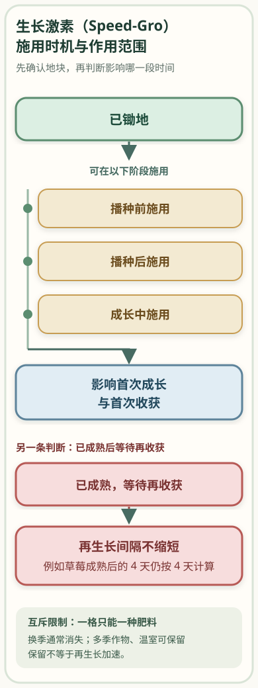
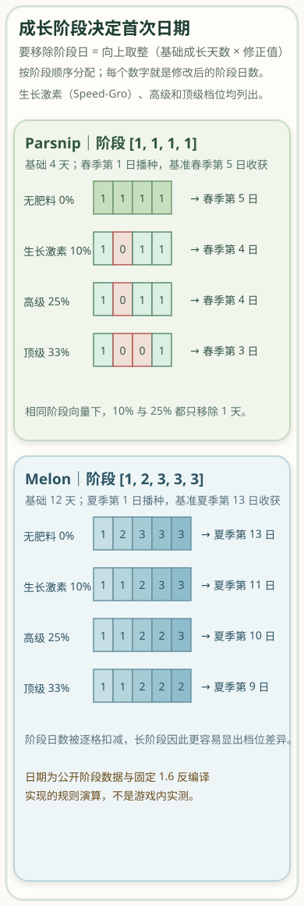
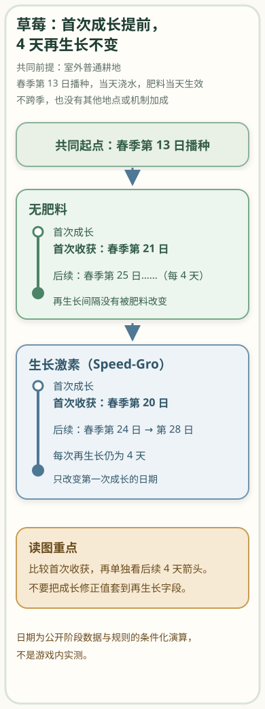

在中文资料里，生长激素（Speed-Gro）要施在已经锄好的地块上，播种前、播种后或作物成长中都可以使用；它主要改变第一次成长到收获的时间，不会把多次收获作物成熟后的再生长间隔一起缩短。这里最容易混淆的地方是“加速 10%”（[生长激素中文条目](https://zh.stardewvalleywiki.com/%E7%94%9F%E9%95%BF%E6%BF%80%E7%B4%A0)）并不等于日历一定少 10%：真正的首次收获日还取决于作物的成长阶段、阶段日数和施用时机。

下文按目前可核对的 1.6.15 PC 版本线与 1.6.15.1 主机版本线整理；如果你的游戏显示其他版本，应以游戏内版本为准。版本锚点可分别查看 [Steam 的 1.6.15 公告](https://store.steampowered.com/news/app/413150/view/517448731263500640?l=english) 和 [主机 1.6.15.1 补丁公告](https://www.stardewvalley.net/1-6-15-1-patch-for-xbox-playstation/)。

## 先把生长激素（Speed-Gro）对上

中文玩家查找 `Speed-Gro` 时，首先要认准“生长激素”这个名称，而不是把口语里的“速效肥料”当成另一个已经核验的物品名。[中文资料页面把“生长激素”与 `Speed-Gro` 并列](https://xinglugu.huijiwiki.com/wiki/%E7%94%9F%E9%95%BF%E6%BF%80%E7%B4%A0)，所以你看到英文物品名或中文条目名时，可以先把它们视为同一个基础档位。高级生长激素（Deluxe Speed-Gro）与顶级生长激素（Hyper Speed-Gro）是另外两个档位。

下面的百分比是物品的**标称成长速度修正值（modifier）**，不是把成熟日历直接按同样百分比削减。农业学家（Agriculturist）会额外加上 10 个百分点，因此它和肥料修正值是相加关系；这张表只用于识别档位和理解计算，不用于判断价格、配方或收益。

| 肥料 | 官方英文名 | 标称成长速度修正值 | 有农业学家时的合计修正值 |
| --- | --- | ---: | ---: |
| 生长激素 | `Speed-Gro` | 10% | 20% |
| 高级生长激素 | `Deluxe Speed-Gro` | 25% | 35% |
| 顶级生长激素 | `Hyper Speed-Gro` | 33% | 43% |

普通档位的 10% 与农业学家后的 20% 可在 [生长激素中文条目](https://zh.stardewvalleywiki.com/%E7%94%9F%E9%95%BF%E6%BF%80%E7%B4%A0) 核对；25% 和 35% 见 [高级生长激素条目](https://zh.stardewvalleywiki.com/%E9%AB%98%E7%BA%A7%E7%94%9F%E9%95%BF%E6%BF%80%E7%B4%A0)，33% 和 43% 见 [顶级生长激素条目](https://stardewvalleywiki.com/Hyper_Speed-Gro?oldid=190377)。这些数字表达“成长速度修正值”，不要直接改写成“所有作物都固定提前几天”。

## 把肥料用在正确的地块和时机

### 先看地块是不是可施用状态

目标必须是已经锄好的土地。未锄地不能直接当作施肥目标；已经有另一种肥料的地块也不能再叠加生长激素。每一格只能保留一种肥料，这条限制在 [肥料机制页面](https://zh.stardewvalleywiki.com/%E8%82%A5%E6%96%99) 中有明确说明。实际判断时先看地面，再看这一格有没有其他肥料：不满足其中任一条件，就先处理地块，不要把两种肥料的效果相加。

### 播种前、播种后和成长中都可以用

在已经锄好的空地上，可以先撒生长激素，再播种。若种子已经种下，也可以把肥料施到已种的作物格；作物已经进入成长阶段时，仍然可以施用。三种生长激素的资料都允许播种前、播种后或任何成长阶段施用：[Speed-Gro 的条目](https://stardewvalleywiki.com/Speed-Gro?oldid=190630)、[Deluxe Speed-Gro 的条目](https://stardewvalleywiki.com/Deluxe_Speed-Gro?oldid=191196) 与 [Hyper Speed-Gro 的条目](https://stardewvalleywiki.com/Hyper_Speed-Gro?oldid=190377) 都列出这些时机；Speed-Gro 条目还说明，晚一点施用时只会按尚未完成的成长阶段处理，不会把已经通过的阶段追回来。

这意味着“现在施还是晚一点施”的判断不应该只看百分比。若作物刚播下，较多成长阶段尚未完成，修正值有更多阶段可以影响；若作物已经成长了一段时间，已完成的阶段不会重新打开，剩余时间实际减少多少要按阶段日数计算。因此，晚施并不等于一定失效，但也不能把剩余日数简单乘以 90%、75% 或 67%。

### 已成熟、等待下一次收获时，不要期待间隔变短

对草莓、咖啡豆等成熟后会重复产出的作物，生长激素的作用边界是第一次成长和首次收获。第一次收获之后，下一次产出的间隔由作物自己的再生长数据决定；肥料不会把这个间隔再乘一次修正值。换句话说，已经成熟的作物如果只是等待下一轮收获，正确的问题不是“还能不能把四天变成更短”，而是“我是否需要在第一次收获前加速”。

*图 1：生长激素可以在犁过的土地上于播种前、播种后或成长中施用，但多次收获作物的再生长间隔不因此缩短。*

换季时还要把“肥料是否保留”和“生长是否加速”分开看。普通情况下，肥料会随换季消失；多季作物在下一季仍能生长时，或温室中的地块，肥料可以保留。保留描述的是地块状态，并不代表生长激素开始影响下一次再生长间隔。这个边界也可在 [Fertilizer 的版本页面](https://stardewvalleywiki.com/Fertilizer?oldid=194274) 对照。

## 为什么 10% 不等于固定少一天

要算首次收获日，先把作物的成长时间看成一串阶段，而不是一个可以随意按百分比缩短的总数。例如，一个作物可能按 `[1, 2, 3, 3, 3]` 这样的阶段日数成长。公开的 1.6 反编译快照（decompiled snapshot）可以作为实现交叉证据：它先恢复各阶段日数，计算 `ceil(基础成长天数 × 修正值)`，再从前往后把可减少的阶段日数逐步扣除。这个 [固定提交中的 HoeDirt.cs 实现](https://github.com/AcidicNic/StardewValleyDecompiled1.6/blob/2878fb248092f9f5b8704ad2cc7e19d0abe1cf45/StardewValley.TerrainFeatures/HoeDirt.cs#L584-L629) 不是开发者发布的官方源代码，也不是本次运行游戏实测；它的用途是帮助解释为什么阶段长度会改变结果。

可以把它压缩成一个读者可复核的判断式：先把真实成长阶段相加得到基础天数，再用向上取整得到要移除的阶段日，最后按阶段顺序分配这些减少量。第一阶段原本只有 1 天时，不能因为 10% 就被减成 0；后面的阶段才可能承担减少量。因此，短作物的两个档位可能得到同一个首次收获日，长作物则更容易看出档位差异。

### 短阶段示例：防止把高级档位想成必然多减一天

Parsnip 的公开阶段数据是 `[1, 1, 1, 1]`，基础成长时间为 4 天。[Parsnip 条目](https://stardewvalleywiki.com/Parsnip?oldid=191123) 以春季作物资料列出这组阶段日数。假设春季第 1 日播种、当天浇水，且只比较首次收获日期，那么不施肥的演算结果是春季第 5 日；Speed-Gro 的 10% 和 Deluxe Speed-Gro 的 25% 都只得到一次可分配的阶段日减少，结果同为春季第 4 日；Hyper Speed-Gro 的 33% 则演算为春季第 3 日。

这里“10% 与 25% 同一天”不是说两个物品完全相同，而是 4 天总长度经过向上取整后，阶段分配都只产生一次减少。它也不是任意四天作物的通用承诺；换作不同的阶段向量，结果可能不同。

### 长阶段示例：阶段长度让差异显现

Melon 的公开阶段数据是 `[1, 2, 3, 3, 3]`，基础成长时间为 12 天。[Melon 条目](https://stardewvalleywiki.com/Melon?oldid=193510) 列出了这组阶段日数。假设夏季第 1 日播种、当天浇水、没有温室或其他地点加成，首次收获日期的规则演算如下：

| 前提 | 成长速度修正值 | 演算后的首次收获日 |
| --- | ---: | --- |
| 不施肥 | 0% | 夏季第 13 日 |
| Speed-Gro | 10% | 夏季第 11 日 |
| Deluxe Speed-Gro | 25% | 夏季第 10 日 |
| Hyper Speed-Gro | 33% | 夏季第 9 日 |

如果同时有农业学家，成长速度修正值分别变成 20%、35% 和 43%，同一组前提下的日期演算为 Speed-Gro 夏季第 10 日、Deluxe Speed-Gro 夏季第 8 日、Hyper Speed-Gro 夏季第 7 日。农业学家提供的是额外 10 个百分点，而不是把已经算出的肥料百分比再乘一次；[Farming 条目](https://stardewvalleywiki.com/Farming?oldid=191914) 与上面的公开实现可以交叉核对这一点。

*图 2：Parsnip 与 Melon 的日期示例按公开阶段数据和固定 1.6 反编译实现演算；阶段分配与向上取整决定首次日期，不是游戏内实测。*

这组表格和图示的作用，是教你检查自己的作物，而不是让你背一个“10% 等于少一天”的固定口诀。查作物时至少记录三项：阶段日数、播种日期、施用时作物已经完成了哪些阶段。若只知道总成长天数，却不知道阶段构成，就只能得到条件化估计，不能把百分比直接换成日历答案。

## 多次收获作物：用草莓日期检查首次收获

草莓（Strawberry）很适合用来分辨“首次成长”和“再生长”这两件事。它的基础成长时间是 8 天，成熟后每 4 天收获一次；公开草莓资料也把成长和再生长分成两个数据。生长激素进入的是第一次 8 天成长的计算，不会把成熟后的 4 天间隔改成更短。[草莓条目](https://zh.stardewvalleywiki.com/%E8%8D%89%E8%8E%93) 提供了成长、再生长和春季种植条件的核对入口。

下面只看一个有明确前提的日期案例：室外普通耕地，春季第 13 日播种，当天浇水，肥料当天已经生效，不跨季，也没有其他地点或机制加成。表格中的日期按公开阶段数据和上面的规则演算，只描述第一次成长及其后的固定再生长。

| 种植前提 | 首次收获 | 后续收获 | 肥料实际改变的部分 |
| --- | --- | --- | --- |
| 春季第 13 日播种，不施肥 | 春季第 21 日 | 春季第 25 日…… | 无首次成长加速 |
| 春季第 13 日播种，Speed-Gro | 春季第 20 日 | 春季第 24 日、春季第 28 日…… | 只提前第一次成长，4 天再生长不变 |

在这些前提下，提前首次收获所释放的时间可能让春季多出一次收获；但这个结论依赖播种日、浇水、作物成长数据和季节边界，不能改写成“草莓永远三熟”，也不能外推成任意作物、任意种植日或任意肥料档位都能多一轮。中文资料把它作为带条件的案例，而不是无条件收益保证。

*图 3：在春季第 13 日播种、当天浇水且无其他条件变化的演算中，Speed-Gro 将首次收获从春季第 21 日提前到春季第 20 日；后续仍按 4 天再生长。*

读这条时间线时，把首轮成长箭头与后续 4 天再生长箭头分开；把前者的修正值套到后者，才会得到“间隔变短”的错误结论。

## 最后用三问检查一次施用判断

面对自己的地块，可以按下面三问作出下一步决定：

1. **这块地已经锄好，而且没有另一种肥料吗？** 如果没有，先把地块处理成可施用状态；如果已有肥料，就不能再叠加生长激素。
2. **我想提前的是第一次成熟，还是下一次再生长？** Speed-Gro 适合判断第一次成长和首次收获；若目标是缩短草莓成熟后的 4 天、[咖啡豆条目中的 2 天](https://stardewvalleywiki.com/Coffee_Bean?oldid=193175)等再生长间隔，它不是这个判断的依据。
3. **我手上有作物阶段、成熟日和再生长数据吗？** 有数据时，把播种日、当天是否浇水、季节和地点条件写进前提，再按阶段计算首次日期；没有数据时，只能给出条件化判断，不应编造一个固定提前天数。

## 参考来源

- [生长激素 - 星露谷物语中文维基](https://zh.stardewvalleywiki.com/%E7%94%9F%E9%95%BF%E6%BF%80%E7%B4%A0)
- [肥料 - Stardew Valley Wiki](https://zh.stardewvalleywiki.com/%E8%82%A5%E6%96%99)
- [草莓 - 星露谷物语中文维基](https://zh.stardewvalleywiki.com/%E8%8D%89%E8%8E%93)
- [Coffee Bean - Stardew Valley Wiki（固定版本页面）](https://stardewvalleywiki.com/Coffee_Bean?oldid=193175)
- [Speed-Gro - Stardew Valley Wiki（固定版本页面）](https://stardewvalleywiki.com/Speed-Gro?oldid=190630)
- [Deluxe Speed-Gro - Stardew Valley Wiki（固定版本页面）](https://stardewvalleywiki.com/Deluxe_Speed-Gro?oldid=191196)
- [Hyper Speed-Gro - Stardew Valley Wiki（固定版本页面）](https://stardewvalleywiki.com/Hyper_Speed-Gro?oldid=190377)
- [Fertilizer - Stardew Valley Wiki（固定版本页面）](https://stardewvalleywiki.com/Fertilizer?oldid=194274)
- [Parsnip - Stardew Valley Wiki（固定版本页面）](https://stardewvalleywiki.com/Parsnip?oldid=191123)
- [Melon - Stardew Valley Wiki（固定版本页面）](https://stardewvalleywiki.com/Melon?oldid=193510)
- [Farming - Stardew Valley Wiki（固定版本页面）](https://stardewvalleywiki.com/Farming?oldid=191914)
- [HoeDirt.cs：1.6 decompiled snapshot 固定提交](https://github.com/AcidicNic/StardewValleyDecompiled1.6/blob/2878fb248092f9f5b8704ad2cc7e19d0abe1cf45/StardewValley.TerrainFeatures/HoeDirt.cs#L584-L629)
- [Crop Growth Calendars - Stardew Valley Wiki（固定版本页面）](https://stardewvalleywiki.com/Crop_Growth_Calendars?oldid=189875)
